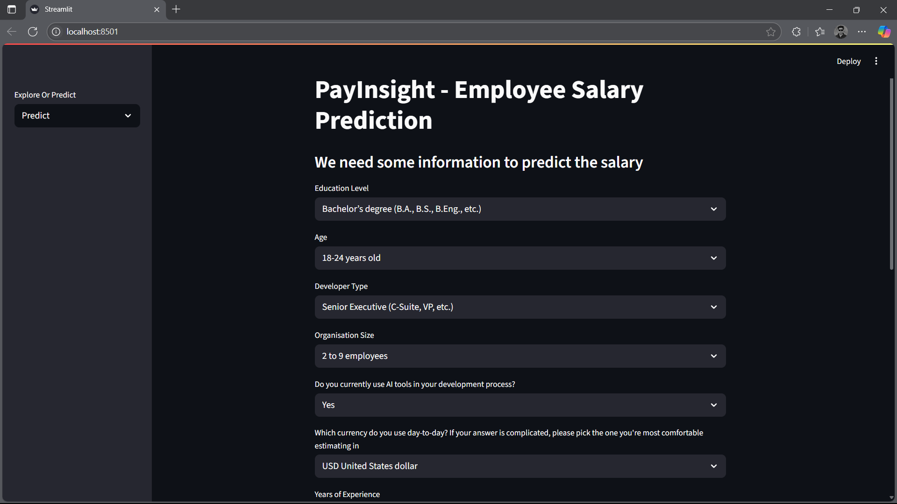
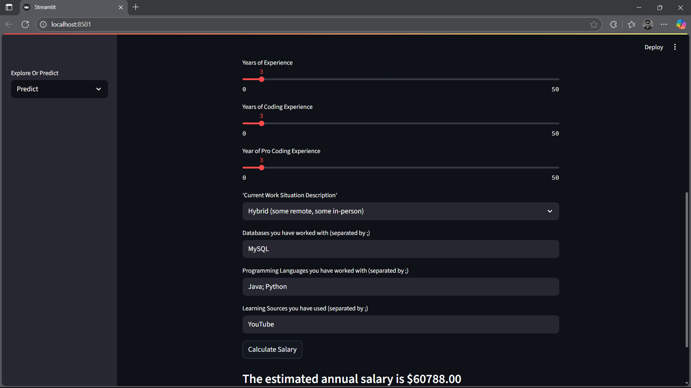

# 💼 PayInsight – Employee Salary Prediction

> A machine learning powered web app that predicts the salary of software developers based on factors like education, experience, role, and location. Built using Python, Scikit-learn, Streamlit, and Jupyter Notebooks.

---

## 📁 Project Structure

```
employee-salary-prediction-ml/
├── app/
│   ├── __pycache__/
│   ├── app.py                 # Streamlit app main entry
│   ├── predictor.py           # Model loading and prediction logic
│   └── model_final.py         # Preprocessing and prediction handler
│
├── Datasets/
│   ├── updated_dataset.csv    # Cleaned dataset for training
│   └── valcnt.txt             # Validation value counts
│
├── Model/
│   ├── model.pkl              # Final saved model
│   ├── model_2.pkl
│   └── model_3.pkl
│
├── Notebooks/
│   ├── Model_Final.ipynb
│   ├── Model_2.ipynb
│   ├── Salary_Prediction_Model.ipynb
│   ├── Salary_prediction.ipynb
│   ├── Salary_Prediction_Filtering.ipynb
│   └── Untitled.ipynb        
│
├── Screenshots/
│   ├── screenshot-1.png      
│   └── screenshot-2.png       
│
├── requirements.txt           # Required Python packages
├── .gitattributes
├── venv/                      # Python virtual environment
└── README.md
```

---

## 🚀 Getting Started

### 1. Clone the Repository

```bash
git clone https://github.com/abbasdx/employee-salary-prediction.git
cd employee-salary-prediction-ml
```

### 2. Create Virtual Environment & Activate

```bash
# For Windows
python -m venv venv
venv\Scripts\activate

# For macOS/Linux
python3 -m venv venv
source venv/bin/activate
```

### 3. Install Dependencies

```bash
pip install -r requirements.txt
```

---

## ▶️ Run the Web App

```bash
streamlit run app/app.py
```

Visit `http://localhost:8501` in your browser to access the app.

---

## 📸 Screenshots



---

## ⚙️ How It Works

1. **Data Preprocessing**: Cleaned and encoded a real-world dataset of developer salaries.
2. **Model Training**: Trained multiple regression models (Linear, RandomForest, etc.) and finalized one based on accuracy.
3. **Web App**: Used Streamlit to create an interactive interface for input and salary prediction.
4. **Model Deployment**: Model saved as `.pkl` and integrated into the Streamlit app via `predictor.py`.

---

## 🛠️ Tech Stack

- **Frontend**: Streamlit
- **Backend**: Python
- **Machine Learning**: scikit-learn, pandas, numpy
- **Development Tools**: VS Code

---

## 🤝 Contributing

Pull requests are welcome! If you want to improve the UI, add models, or improve accuracy:

1. Fork the repo
2. Create your feature branch: `git checkout -b feature/YourFeature`
3. Commit your changes: `git commit -m 'Add some feature'`
4. Push to the branch: `git push origin feature/YourFeature`
5. Open a pull request

---

## 📄 License

This project is licensed under the [MIT License](LICENSE).

